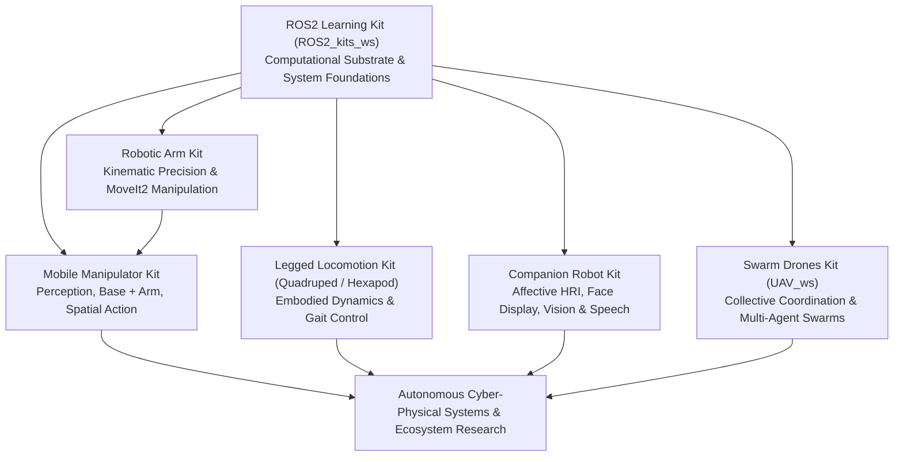

# Kits & Products Strategy: The Intelligent Ecosystem Product Layer

**Document Type:** Canonical Strategic & Architectural Specification  
**Domain:** ROS2 & Embodied Intelligent Systems  
**Status:** Approved Product Architecture  

---

## 1. Executive Summary & Core Product Philosophy

The Intelligent Ecosystem does not sell a disconnected collection of hardware parts. 

> **"Don't sell a pile of components. Sell a path into intelligent robotics."**

Each kit is a deliberate, complete **experimental product layer** inside the Intelligent Ecosystem that provides a structured pathway:

$$\text{Learning} \longrightarrow \text{Experimentation} \longrightarrow \text{Projects} \longrightarrow \text{Intelligent Systems}$$

Every kit in the portfolio is engineered around the **Triad of Embodiment**:

```
┌─────────────────────────────────────────────────────────────────────────────┐
│                              THE KIT TRIAD                                  │
│                                                                             │
│   ┌──────────────────────┐   ┌──────────────────────┐   ┌─────────────────┐ │
│   │       HARDWARE       │   │       SOFTWARE       │   │    KNOWLEDGE    │ │
│   │ Physical Embodiment  │ + │ ROS2 Architecture,   │ + │ Articles, Labs, │ │
│   │ & Actuator Chassis   │   │ Drivers, & Demos     │   │ & Breakers      │ │
│   └──────────────────────┘   └──────────────────────┘   └─────────────────┘ │
└─────────────────────────────────────────────────────────────────────────────┘
```

- **Hardware** provides the physical reality and sensory-motor constraints.
- **Software (ROS2)** provides the distributed computational structure and data pipelines.
- **Knowledge** provides the conceptual mental models, decision heuristics, and experiment challenges.

### The Developer's Lifecycle: Beyond Assembly
A kit does not end with hardware assembly. It initiates an iterative learning loop:
$$\text{Learn} \longrightarrow \text{Experiment} \longrightarrow \text{Modify} \longrightarrow \text{Break (Diagnose)} \longrightarrow \text{Understand} \longrightarrow \text{Build Project} \longrightarrow \text{Contribute Knowledge}$$

---

## 2. Progressive Dimensions of Robotic Intelligence

Rather than isolated, disposable gadgets, the kit portfolio forms an integrated continuum where each embodiment exposes and investigates a distinct dimension of robotic intelligence:

```
┌─────────────────────────────────────────────────────────────────────────────┐
│                    PORTFOLIO OF INTELLIGENCE DIMENSIONS                     │
│                                                                             │
│  [1. ROS2 Core Kit]        ──▶ Computational & System Intelligence          │
│  [2. Robotic Arm Kit]      ──▶ Kinematic & Precision Manipulation           │
│  [3. Mobile Manipulator]   ──▶ Perception → Decision → Spatial Action       │
│  [4. Legged Locomotion]    ──▶ Embodied & Dynamic Locomotion                │
│  [5. Companion Robot]      ──▶ Interaction & Social Intelligence            │
│  [6. Swarm Drones]         ──▶ Collective & Distributed Intelligence        │
└─────────────────────────────────────────────────────────────────────────────┘
```



---

## 3. Product Verticals: Specification & Roadmap

### Vertical 0: ROS2 Computational Substrate Kit (`ROS2_kits_ws`)
- **Primary Focus:** The software foundation of distributed robotics.
- **Package Architecture:** 8 standardized core packages (`learning_core`, `learning_comms`, `learning_execution`, `learning_lifecycle`, `learning_tf`, `learning_simulation`, `learning_debugging`, `learning_integration`).
- **Core Curriculum:** 25 ROS2 Articles (Series A0 to H1).
- **Role:** The software laboratory teaching computation graphs, interfaces, lifecycle, TF trees, and debugging.

---

### Vertical 1: Robotic Arm Kit (`Robotic_Arm_ws` / `ros2_arm_kit`)
- **Intelligence Dimension:** *Kinematic & Precision Manipulation Intelligence*
- **Physical Embodiment:** Articulated 5/6-DOF robotic arm with end-effector gripper, PCA9685 / Dynamixel / Arduino servo interface, rigid tabletop mounting. (Extracted directly from the proven physical `gripper_car_ws` arm).
- **Core Software:**
  - `arm_description`: URDF/Xacro kinematic chain, joint limits, visual/collision meshes.
  - `arm_controller`: ros2_control joint trajectory and gripper action controllers.
  - `arm_moveit`: MoveIt2 configuration, OMPL planners, KDL/Trac-IK inverse kinematics solvers.
- **Progressive Lab Pathway:**
  1. Joint limits & direct servo PWM calibration.
  2. Forward Kinematics (FK) and end-effector TF tree propagation.
  3. Cartesian Inverse Kinematics (IK) reachability and singularity handling.
  4. MoveIt2 collision-free trajectory planning and execution.
  5. Gripper Action Server (`/gripper_command`) with force/stall detection.
  6. Precision tabletop pick-and-place task execution.

---

### Vertical 2: Mobile Manipulator Kit (`Mobile_Manipulator_ws` / `ros2_mobile_manipulator_kit`)
- **Intelligence Dimension:** *Perception $\rightarrow$ Decision $\rightarrow$ Spatial Action Intelligence*
- **Physical Embodiment:** 4WD differential-drive mobile base + 5/6-DOF Arm + 2D LiDAR (YDLiDAR) + RGB/Depth Camera (Pi Camera/RealSense) + Dual MCU/SBC architecture.
- **Core Software:**
  - `mobile_base_description` & `base_controller`: Differential drive odometry and motor execution.
  - `mobile_manipulator_navigation`: Nav2 costmaps, path planning, and recovery behaviors.
  - `mobile_manipulator_perception`: OpenCV & depth camera 2D/3D object detection and pose estimation.
  - `mobile_manipulator_application`: Master state machine / Behavior Tree coordinating Navigation, Vision, and Arm MoveIt2 manipulation.
- **Progressive Lab Pathway:**
  1. Autonomous base navigation in map (Nav2).
  2. Visual object detection & 3D pose extraction ($\text{Camera} \rightarrow \text{Base} \rightarrow \text{Arm}$ frame transformations).
  3. Visual servoing and base docking near object.
  4. Coordinated reach, grasp, and lift.
  5. Destination transit and placing.
  6. Error recovery: Handling IK unreachable goals and obstacle replanning.

---

### Vertical 3: Legged Locomotion Kit (`ros2_quadruped_kit` / Hexapod)
- **Intelligence Dimension:** *Embodied & Dynamic Locomotion Intelligence*
- **Physical Embodiment:** 4-Legged (Quadruped) or 6-Legged (Hexapod) chassis with 3-DOF per leg (12/18 high-torque servos), 9-DOF IMU, foot contact sensors. *(Note: Quadruped and Hexapod share identical leg kinematics and gait sequencing principles; hexapod models provide a highly stable stepping stone).*
- **Core Software:**
  - `quadruped_description`: Multi-chain leg kinematics URDF.
  - `quadruped_kinematics`: Analytical leg IK solvers and workspace boundary computation.
  - `quadruped_gait`: Trot, crawl, and wave gait pattern generators.
  - `quadruped_balance`: IMU-driven attitude estimation and active roll/pitch balance compensation.
- **Progressive Lab Pathway:**
  1. Single leg calibration and 3D foot-tip workspace visualization.
  2. Static stability crawl/wave gait execution.
  3. Dynamic trot gait generation with body posture stabilization.
  4. Active disturbance rejection (IMU feedback on inclined planes).
  5. Terrain adaptation and obstacle step-over.

---

### Vertical 4: Companion Robot Kit (`ros2_companion_head_kit`)
- **Intelligence Dimension:** *Social & Interaction Intelligence*
- **Physical Embodiment:** Expressive OLED/LCD digital face display, 2-DOF pan-tilt neck mechanism, wide-angle camera, microphone array, speaker. Can operate as a desktop social agent or mount onto the mobile manipulator base.
- **Core Software:**
  - `companion_face`: Animated facial expression rendering and UI state graphics.
  - `companion_vision`: Face detection, emotion estimation, and real-time gaze tracking.
  - `companion_audio`: Wake-word detection, speech-to-text (ASR), and speech synthesis (TTS).
  - `companion_behavior`: Affective state machine (Mood Engine) and social dialogue orchestration.
- **Progressive Lab Pathway:**
  1. Digital expression rendering (Joy, Curiosity, Neutral, Alert).
  2. Visual pan-tilt head tracking following human faces.
  3. Interactive voice command and response loop.
  4. Dynamic mood transitions based on environment sensory input.
  5. Mounting on mobile robot for embodied human-robot interaction.

---

### Vertical 5: Swarm Drones Kit (`UAV_ws` / `ros2_drone_swarm_kit`)
- **Intelligence Dimension:** *Collective & Swarm Intelligence*
- **Physical Embodiment:** Multi-agent micro-aerial vehicles (UAVs), optical flow / UWB indoor localization, micro-SBC / flight controller (PX4 / micro-ROS / ROS2 bridge), inter-agent mesh communication.
- **Core Software:**
  - `drone_bringup`: Flight controller bridge and state estimation (`/odom`, `/battery_state`).
  - `swarm_orchestrator`: Multi-robot namespacing (`/drone_1`, `/drone_2`, ...), launch composition.
  - `swarm_formation`: Leader-follower and virtual structure formation controllers.
  - `swarm_consensus`: Distributed spatial agreement and decentralized area coverage.
- **Progressive Lab Pathway:**
  1. Single drone kinematic hover, waypoint tracking, and safety land triggers.
  2. Multi-drone namespace instantiation and centralized command dispatch.
  3. Leader-follower geometric formation flight.
  4. Distributed collision avoidance using potential fields.
  5. Cooperative search-and-survey coverage algorithms.

---

## 4. Competitive Moat: The Uncopyable Product

Anyone can manufacture an injection-molded chassis or assemble commodity servos. A hardware kit is easily commoditized.

The Intelligent Ecosystem moat is the **unbreakable synthesis**:

$$\textbf{Custom Hardware} + \textbf{Production ROS2 Stack} + \textbf{Structured Curriculum} + \textbf{Hands-On Labs} + \textbf{Failure Breakers} + \textbf{AI Knowledge Ecosystem}$$

This establishes the kits not merely as educational toys, but as **standardized experimental bodies** for ongoing intelligent robotics research.
