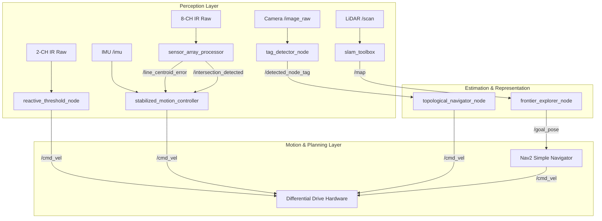

# System Architecture: Line Follower Evolution Workspace

**Workspace:** `Line_Follower_Evolution_ws`  
**Associated Curriculum Series:** `07_Line_Follower_Evolution_Series` (Articles LFE-01 through LFE-08)  
**Target Platform:** ROS 2 Humble / Jazzy / Linux x86_64 & ARM64 / Arduino Embedded C++  
**Architecture Version:** 2.0 (Fully Grounded Multi-Generational Autonomous Robotics Stack)  

---

## 1. Architectural Overview & The 4 Generations

The `Line_Follower_Evolution_ws` embodies a systematic, ground-up progression through four structural paradigms of autonomous robotics:

```text
┌────────────────────────────────────────────────────────────────────────────────────────────────────────┐
│                                 4-GENERATION ROBOTIC EVOLUTION ROADMAP                                 │
├─────────────────────────┬─────────────────────────┬─────────────────────────┬──────────────────────────┤
│ GENERATION 1 (V1)       │ GENERATION 2 (V2–V3)    │ GENERATION 3 (V4–V5)    │ GENERATION 4 (V6)        │
│ Reactive Baseline       │ Physical Intelligence   │ Symbolic Intelligence   │ Spatial Intelligence     │
├─────────────────────────┼─────────────────────────┼─────────────────────────┼──────────────────────────┤
│ • 2-IR Thresholding     │ • 8-Channel IR Array    │ • Topological Graph     │ • 2D 360° LiDAR          │
│ • Bang-Bang Logic       │ • Weighted Centroid     │ • AprilTag Landmark Tag │ • SLAM Toolbox Carto     │
│ • Limit-Cycle Hunting   │ • Inner Velocity PID    │ • Deterministic FSM     │ • Nav2 Costmap & Planner │
│ • No State Memory       │ • Gyro Yaw Damping      │ • Rollback Recovery     │ • Frontier Exploration   │
└─────────────────────────┴─────────────────────────┴─────────────────────────┴──────────────────────────┘
```

---

## 2. Package Ecosystem & Node Graph Topology

The workspace contains 5 modular ROS 2 packages:

```text
Line_Follower_Evolution_ws/
├── line_follower_v1_reactive/
│   ├── reactive_threshold_node.py   # Bang-bang thresholding with hysteresis
│   └── simulated_track_sensor.py    # Synthetic 2-channel IR photodiode publisher
├── line_follower_v2_v3_stabilized/
│   ├── sensor_array_processor.py    # 8-channel weighted centroid & crossbar detection
│   └── stabilized_motion_controller.py # Dual-loop PID, IMU gyro damping, curve deceleration
├── line_follower_v4_v5_topological/
│   ├── tag_detector_node.py         # Visual landmark / AprilTag detector bridge
│   ├── topological_navigator_node.py# Graph-based FSM router with rollback recovery
│   └── maps/warehouse_topology_graph.json # JSON adjacency graph representation
├── line_follower_v6_exploratory/
│   └── frontier_explorer_node.py    # Vectorized 4-neighbor boundary frontier extractor
├── line_follower_evolution_bringup/
│   └── launch/master_evolution_selector.launch.py # Parameterized multi-gen launch
├── arduino/
│   └── line_follower_controller/line_follower_controller.ino # Physical MCU firmware
└── scripts/
    ├── pseudo_line_follower_emulator.py # POSIX PTY virtual serial & sensor emulator
    └── test_line_follower_evolution.py  # 8-phase automated verification test suite
```

### Node Interaction Diagram



---

## 3. Mathematical Foundations & Control Derivations

### 3.1 V1: Reactive Bang-Bang Steering & Limit Cycles
The Generation 1 tracker computes binary steering commands based on left and right analog threshold crossings:
$$\omega = \begin{cases} 
0.0 & \text{if } I_L > T \land I_R > T \quad (\text{CENTERED}) \\ 
+\omega_{turn} & \text{if } I_L > T \land I_R \le T \quad (\text{TURN LEFT}) \\ 
-\omega_{turn} & \text{if } I_L \le T \land I_R > T \quad (\text{TURN RIGHT}) \\ 
0.0 & \text{if } I_L \le T \land I_R \le T \quad (\text{LOST LINE - SEARCH}) 
\end{cases}$$
Due to sensor latency $\tau$ and motor inertia $J$, this control law inevitably induces limit-cycle oscillations ("hunting").

### 3.2 V2–V3: 8-Channel Weighted Centroid Perception
To transform discrete detection into continuous state estimation, eight IR phototransistors are spaced evenly across a lateral swath:
$$x_i \in \{-35, -25, -15, -5, +5, +15, +25, +35\}\,\text{mm}$$
The line lateral error $e_{line}$ is computed via the center-of-mass centroid:
$$e_{line} = \frac{\sum_{i=1}^8 x_i \cdot I_i}{\sum_{i=1}^8 I_i}$$
Crossbar intersections (90° junctions) are detected when total illumination exceeds a threshold:
$$\text{IsIntersection} = \left(\sum_{i=1}^8 I_i \ge 8 \cdot I_{cross\_thresh}\right)$$

### 3.3 V2–V3: Closed-Loop Motion with Gyroscopic Damping
The motion layer combines a PD lateral error tracking controller with an inner gyroscopic damping loop:
$$\omega_{cmd} = -K_p \cdot e_{line} - K_d \cdot \frac{de_{line}}{dt} - K_{gyro} \cdot \omega_{z, imu}$$
To prevent tire slip on tight curves, forward velocity is dynamically throttled:
$$v_{cmd} = v_{max} \cdot \max\left(0.25, \; 1.0 - 15.0 \cdot |e_{line}| - 0.2 \cdot |\omega_{z, imu}|\right)$$

### 3.4 V4–V5: Topological Navigation & Fault-Tolerant Rollback FSM
A warehouse track is formalized as an undirected graph $G = (V, E)$. The deterministic FSM governs edge traversal and vertex transitions:
- $\mathbf{S}_0 \text{ (TRAVERSING\_EDGE)} \xrightarrow{\text{Tag Verified } N_k} \mathbf{S}_1 \text{ (EXECUTING\_TURN)}$
- $\mathbf{S}_1 \text{ (EXECUTING\_TURN)} \xrightarrow{\text{Elapsed } \ge t_{turn}} \mathbf{S}_0 \text{ (TRAVERSING\_EDGE)}$
- $\mathbf{S}_0 \text{ (TRAVERSING\_EDGE)} \xrightarrow{\text{Unexpected Tag}} \mathbf{S}_2 \text{ (ROLLBACK\_RECOVERY)}$
- $\mathbf{S}_2 \text{ (ROLLBACK\_RECOVERY)} \xrightarrow{\text{Elapsed } \ge t_{rollback}} \mathbf{S}_0 \text{ (TRAVERSING\_EDGE)}$
- $\mathbf{S}_0 \text{ (TRAVERSING\_EDGE)} \xrightarrow{\text{Final Goal Reached}} \mathbf{S}_3 \text{ (GOAL\_REACHED)}$

### 3.5 V6: Unconstrained Frontier SLAM Boundary Extraction
Given an occupancy grid map $M(x, y) \in \{-1, 0, 100\}$, the set of exploration frontier cells $\mathcal{F}$ is defined strictly as:
$$\mathcal{F} = \left\{ \mathbf{p} \in \mathbb{R}^2 \mid M(\mathbf{p}) = 0 \;\land\; \exists\,\mathbf{n} \in \mathcal{N}_4(\mathbf{p}) \text{ s.t. } M(\mathbf{n}) = -1 \right\}$$
Exploration goals are dispatched to the centroid of the largest continuous frontier cluster:
$$\mathbf{p}_{goal} = \frac{1}{|\mathcal{C}^*|} \sum_{\mathbf{p} \in \mathcal{C}^*} \mathbf{p}$$

---

## 4. Hardware Architecture & Arduino Firmware

### Embedded Microcontroller Schematic (`arduino/line_follower_controller.ino`)
The robot operates on an Arduino Nano / Uno / ESP32 running deterministic real-time loops:

```text
┌────────────────────────────────────────────────────────┐
│                 ARDUINO PINOUT & WIRING                │
├─────────────┬──────────────┬───────────────────────────┤
│ Pin Name    │ Direction    │ Hardware Component        │
├─────────────┼──────────────┼───────────────────────────┤
│ A0 – A7     │ INPUT (ADC)  │ 8-Channel Analog IR Array │
│ D2 (INT0)   │ INPUT (PULL) │ Left Encoder Channel A    │
│ D4          │ INPUT (PULL) │ Left Encoder Channel B    │
│ D3 (INT1)   │ INPUT (PULL) │ Right Encoder Channel A   │
│ D7          │ INPUT (PULL) │ Right Encoder Channel B   │
│ D5 (PWM)    │ OUTPUT       │ Left Motor PWM (Speed)    │
│ D6 (PWM)    │ OUTPUT       │ Right Motor PWM (Speed)   │
│ D8, D9      │ OUTPUT       │ Left Motor IN1, IN2 (Dir) │
│ D10, D11    │ OUTPUT       │ Right Motor IN3, IN4(Dir) │
│ Serial TX/RX│ COMM         │ USB Serial (115200 baud)  │
└─────────────┴──────────────┴───────────────────────────┘
```

### Serial NMEA Telemetry Protocol
The microcontroller streams NMEA-0183 formatted ASCII telemetry at 50 Hz:
```text
$LFE,seq=<uint>,e=<float_m>,int=<0|1>,el=<int_ticks>,er=<int_ticks>,estop=<0|1>*<CHECKSUM_HEX>\n
```
Supported inbound serial commands:
- `$CMD,PING\n` $\to$ Returns `$PONG,LFE_CONTROLLER_ALIVE\n`
- `$CMD,ESTOP\n` $\to$ Halts all PWM outputs immediately and returns `$ACK,ESTOP_ENGAGED\n`
- `$CMD,RESUME\n` $\to$ Restores normal operation and returns `$ACK,NORMAL_OPERATION_RESUMED\n`

---

## 5. Testing Sandbox & Hardware Emulation Layer

For development on machines without physical robots, the workspace provides an integrated emulation and verification environment:

1. **Pseudo-Hardware Serial Bridge (`scripts/pseudo_line_follower_emulator.py`)**:
   - Creates a virtual POSIX pseudo-terminal (`/tmp/ttyLFE_ROBOT`) using `pty`.
   - Generates simulated S-curve track physics ($y(t) = 0.025 \sin(1.2 t)$).
   - Publishes 2-channel IR, 8-channel array, IMU gyro angular velocity, visual tags, and 2D occupancy grid maps.
   - Responds to NMEA commands (`PING`, `ESTOP`, `RESUME`).

2. **Automated 8-Phase Verification Suite (`scripts/test_line_follower_evolution.py`)**:
   - Executes unit, mathematical, and integration tests across all 4 generations.
   - Run via:
     ```bash
     source /opt/ros/humble/setup.bash
     source install/setup.bash
     python3 src/Line_Follower_Evolution_ws/scripts/test_line_follower_evolution.py
     ```

---

## 6. Build and Launch Instructions

```bash
# 1. Build entire workspace
colcon build --symlink-install

# 2. Source workspace overlay
source install/setup.bash

# 3. Launch specific generation
# Generation 1 (V1 Reactive):
ros2 launch line_follower_evolution_bringup master_evolution_selector.launch.py generation:=v1

# Generation 2/3 (V2-V3 Stabilized):
ros2 launch line_follower_evolution_bringup master_evolution_selector.launch.py generation:=v2_v3

# Generation 3 (V4-V5 Topological):
ros2 launch line_follower_evolution_bringup master_evolution_selector.launch.py generation:=v4_v5

# Generation 4 (V6 Exploratory SLAM):
ros2 launch line_follower_evolution_bringup master_evolution_selector.launch.py generation:=v6
```
