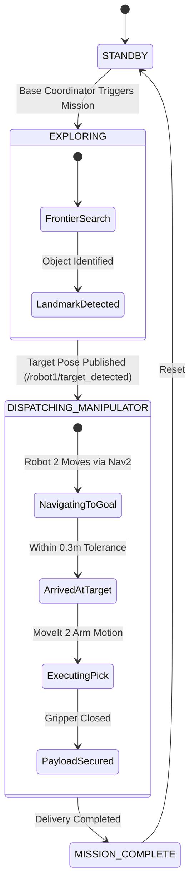

# Article CPS-04: Heterogeneous Robot Roles & Distributed State Machines

**Pedagogical Layer:** Multi-Agent Coordination & Autonomy  
**Focus Area:** Explorer vs Transporter Specialization, Finite State Machine (FSM) Lifecycle, and Asynchronous Task Hand-offs  
**Associated Package:** `cps_coordination/cps_coordination/base_coordinator_node.py`

---

## 1. The Power of Heterogeneous Fleets

In complex cyber-physical environments, deploying homogeneous robots is cost-inefficient. Instead, we specialize agents:
- **Robot 1 (Explorer)**: Lightweight, agile 2WD differential drive chassis optimized for high-speed frontier exploration, LiDAR SLAM, and landmark tagging.
- **Robot 2 (Transporter / Manipulator)**: High-payload 4WD rover equipped with a 5/6-DOF articulated arm and depth camera for precision picking and delivery.
- **Base Coordinator**: High-level supervisory orchestrator managing global state transitions.

---

## 2. Coordinated Mission State Machine



---

## 3. Asynchronous Event-Driven Coordination Node

The `BaseCoordinatorNode` tracks fleet liveness and coordinates hand-offs asynchronously:

```python
def target_detected_callback(self, msg: PoseStamped):
    self.get_logger().info(f'Target detected at ({msg.pose.position.x:.2f}, {msg.pose.position.y:.2f})')
    
    # 1. Update global mission state
    self.mission_phase = 'DISPATCHING_MANIPULATOR'
    
    # 2. Command Transporter/Manipulator (Robot 2) to navigate to the target
    self.pub_robot2_goal.publish(msg)
    
    # 3. Instruct Explorer (Robot 1) to establish perimeter monitoring
    hold_cmd = String(data=json.dumps({'action': 'PERIMETER_SURVEY'}))
    self.pub_robot1_cmd.publish(hold_cmd)
```

---

## 4. Summary & Key Takeaways

- Heterogeneous architectures separate perception density from manipulation load.
- Event-driven state machines guarantee clear responsibility boundaries between robots.
- In [Article CPS-05](article_cps_05_multi_robot_slam_and_map_merging.md), we implement shared 2D spatial occupancy grid fusion.
