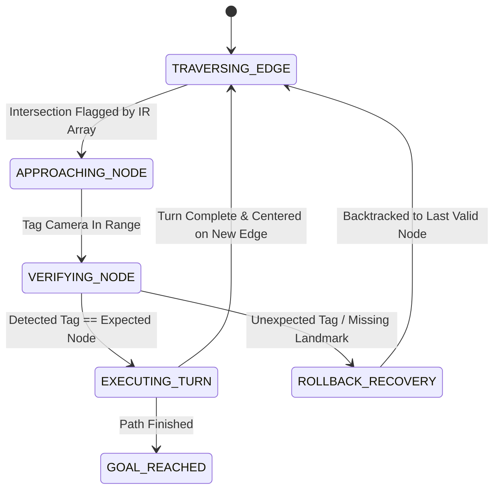

# Article LFE-06: V5 — Edge Traversal State Machines & Rollback Recovery

**Pedagogical Layer:** Deterministic Autonomous Behavior & Fault Tolerance  
**Focus Area:** Finite State Machines, Visual Node Verification, Turning Actions, and Backtracking Recovery  
**Associated Package:** `line_follower_v4_v5_topological`

---

## 1. The Edge Traversal Finite State Machine (FSM)

---

## 2. Deterministic Node Verification & Rollback

When approaching node $k$:
1. The camera reads tag ID $T_{\text{detected}}$.
2. If $T_{\text{detected}} == \Pi[k]$:
   - Verification succeeds. Increment path index $k \leftarrow k + 1$.
   - Execute calibrated yaw pivot $\Delta \theta$ toward target edge.
3. If $T_{\text{detected}} \neq \Pi[k]$ (e.g. branch misread):
   - Trigger **Rollback Recovery**: reverse drive velocity ($v = -0.2\,\text{m/s}$) to backtrack along the line to $\Pi[k-1]$.

---

## 3. Summary & Lessons Learned

V4–V5 provides **symbolic determinism and fault tolerance**: even in the presence of sensor glitches, the robot never gets permanently lost. In [Article LFE-07](article_lfe_07_v6_exploratory_autonomy_slam_and_nav2.md), we remove the line entirely.
